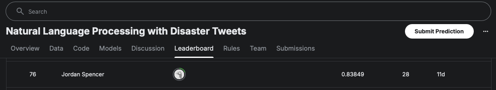

# Disaster Response Tweet Classifier
Collaborative Project | SDSU CS 545 – Machine Learning

## Predicting Natural Disaster Tweets Using Binary Classification

This group project was built for SDSU’s Machine Learning course and is based on the [Kaggle competition: Natural Language Processing with Disaster Tweets](https://www.kaggle.com/competitions/nlp-getting-started/overview). The goal was to classify tweets during disasters into actionable categories to support emergency response systems. I contributed to text preprocessing, model development, and hyperparameter tuning for a multi-output random forest classifier. We deployed the final model using Flask and SQLite to demonstrate how unstructured text data can be transformed into meaningful, actionable output. This project highlights my experience with NLP workflows, model evaluation, and end-to-end machine learning deployment.

Group Members: Tammy Dahl, Tommy Kieu, Kyle Krick, Roger Reinhardt, Jordan Spencer
Environment: This project may be run on jupyterhub.sdsu.edu using the PyTorch notebook with 1 GPU.

## Install Additional Packages
Assuming that you are running this from the PyTorch notebook:

From the root of the repo, run `pip install -r requirements.txt`

## Getting the Raw Data (Optional)
Follow these steps to get the raw data (assumes running linux, macOS or Windows Subsytem for linux):

1. Log into or create your Kaggle account
2. Accept the competition at the link above
3. Install kaggle CLI:
    ```bash
    pip install kaggle
    ```
4. Sign in and download your kaggle.json from [settings](https://www.kaggle.com/settings) > API > Create new token
5. Configure kaggle CLI with kaggle.json:
    ```bash
    mkdir -p ~/.kaggle
    mv ~/Downloads/kaggle.json ~/.kaggle/kaggle.json
    chmod 600 ~/.kaggle/kaggle.json
    ```
6. Run the [get_data.sh](./getting-started/get_data.sh) script or use the [data_exploration](./getting-started/data_exploration.ipynb) notebook

### Processed Datasets
We have included all of our processed datasets for convenience.
Alternatively, you could download the raw data from Kaggle and then step through the datasets notebooks, starting with the [data_cleaner](./datasets/data_cleaner.ipynb) notebook.

## Running the Models
All of our individual models are available in the base-models directory.
These models are logically named after the type of machine learning model that they defined, trained and evaluated.
- Note: the BERT Finetuned model was too large to check into git and may be submitted separately for this assignment as "finetuned_bert_model.tar.gz". Otherwise, run the [finetuned_bert](./base-models/finetuned_bert.ipynb) notebook to produce the model.
- Note: The BERT Finetuned model should be placed at the path `base-models/finetuned_bert/` and extracted with the command `tar -xzvf finetuned_bert_model.tar.gz`, the filename should be `model.safetensors`

### Final Model
Our best and final model, which we submitted to Kaggle for the competition, is the [Modular Ensemble](./stacking-models/modular_ensemble.ipynb).
- Note: All other models should be saved to .pkl file before running this notebook.
- Note: The BERT Finetuned model should be placed at the path `base-models/finetuned_bert/` and extracted with the command `tar -xzvf finetuned_bert_model.tar.gz`, the filename should be `model.safetensors`

## Evaluation
Each of our models' respective notebook contains evaluation code to check its accuracy, precision, recall and F1 scores which are then saved to the [scores](./evaluation/scores.csv) file used in the evaluation notebook.
In addition to inline evaluation, we generated charts for comparison in the [evaluation](./evaluation/evaluation.ipynb) notebook.

## Prediction
You may load up and run our model against arbitrary text using the [prediction](./prediction/prediction.ipynb) notebook.
- Note: All other models should be saved to .pkl file before running this notebook.
- Note: The BERT Finetuned model should be placed at the path `base-models/finetuned_bert/` and extracted with the command `tar -xzvf finetuned_bert_model.tar.gz`, the filename should be `model.safetensors`

## Results
Our best model, the modular ensemble, gained a competition score of 0.83849 placing us at position 76 on the leaderboard at the time of writing. 

